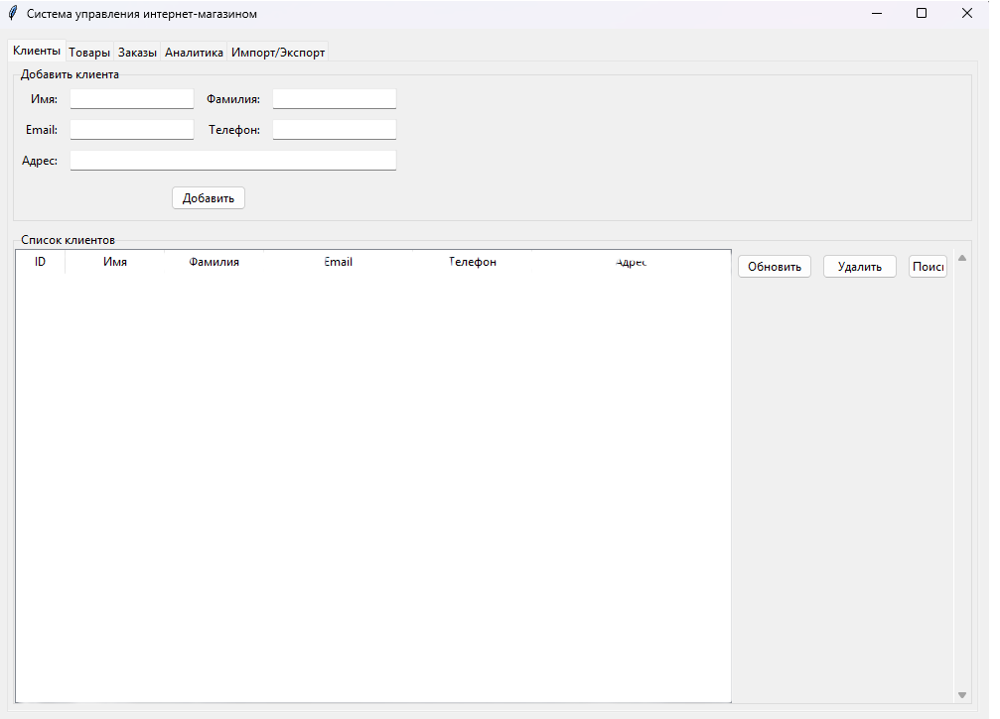
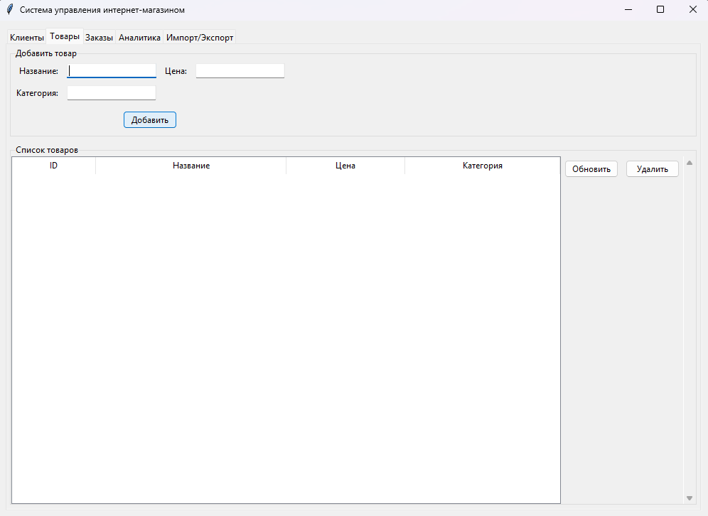
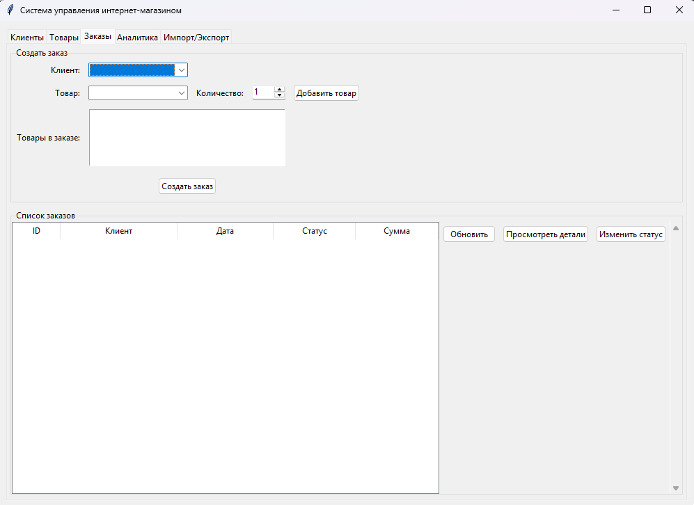
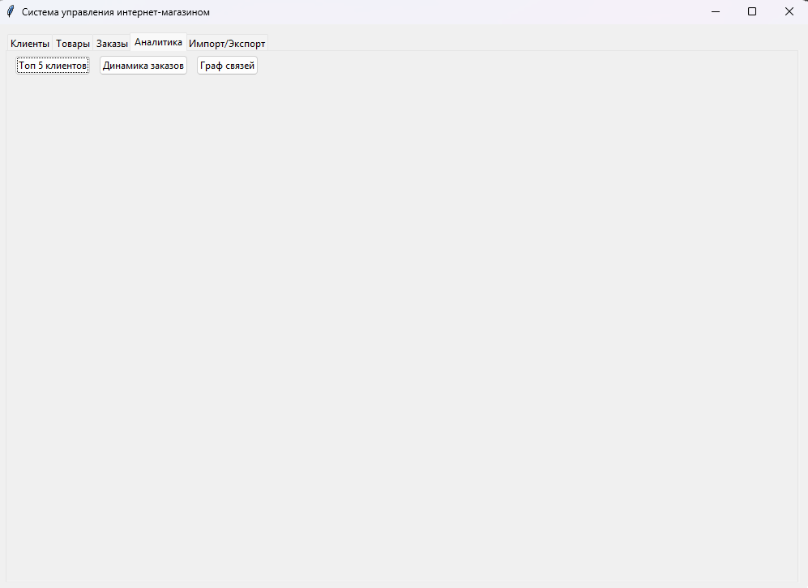
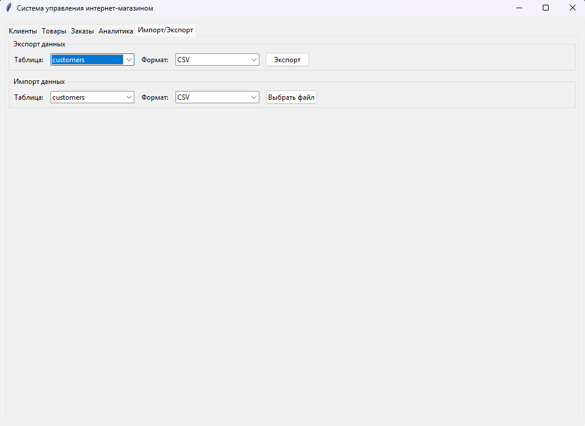

# Система управления интернет-магазином

Прототип промышленной системы учёта заказов, клиентов и товаров с графическим интерфейсом, базой данных и возможностью анализа данных.

## Функциональность

- Регистрация клиентов и их контактные данные
- Управление товарами и категориями
- Создание и отслеживание заказов
- Анализ данных и визуализация (топ клиентов, динамика заказов, граф связей)
- Импорт/экспорт данных в форматах CSV и JSON
- Валидация данных с использованием регулярных выражений

## Установка и запуск

### Требования
- Python 3.8+
- Установленные зависимости из requirements.txt

### Установка
1. Клонируйте репозиторий:
git clone https://github.com/ramilrx22-max/shop-management-system.git
cd shop-management-system

2. Установите зависимости:
pip install -r requirements.txt

3. Запустите приложение:
python main.py

## Структура проекта
- main.py - Точка входа в приложение
- models.py - Модели данных (Customer, Product, Order)
- db.py - Работа с базой данных SQLite
- gui.py - Графический интерфейс (tkinter)
- analysis.py - Анализ и визуализация данных
- test_models.py - Тесты для моделей
- test_analysis.py - Тесты для анализа данных
- requirements.txt - Зависимости проекта

## Скриншоты

### Управление клиентами

### Управление товарами

### Создание заказов

### Аналитика данных

### Импорт/экспорт данных

## Использование
1. Клиенты: Добавляйте и управляйте клиентами
2. Товары: Добавляйте товары в систему
3. Заказы: Создавайте заказы с выбором клиентов и товаров
4. Аналитика: Просматривайте аналитику и графики
5. Импорт/Экспорт: Работайте с данными в форматах CSV и JSON

## Технологии
- Python 3.8+
- Tkinter - графический интерфейс
- SQLite - база данных
- Pandas - анализ данных
- Matplotlib/Seaborn - визуализация
- NetworkX - построение графов
- Unittest - тестирование

## Автор
Ramil Khusnutdinov

## Лицензия
MIT License
